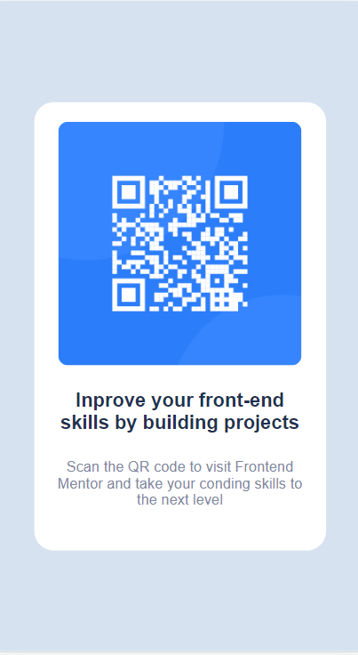
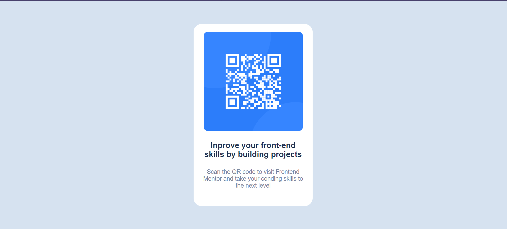

# Frontend Mentor - QR code component solution

This is a solution to the [QR code component challenge on Frontend Mentor](https://www.frontendmentor.io/challenges/qr-code-component-iux_sIO_H). Frontend Mentor challenges help you improve your coding skills by building realistic projects. 

## Table of contents

- [Overview](#overview)
  - [Screenshot](#screenshot)
  - [Links](#links)
- [My process](#my-process)
  - [Built with](#built-with)
  - [What I learned](#what-i-learned)
  - [Continued development](#continued-development)
  - [Useful resources](#useful-resources)
- [Author](#author)
- [Acknowledgments](#acknowledgments)

## Overview

* The goal is to create the layout as similar as possible to the mockup provided by Frontend Mentor, according to the images provided below.

### Screenshot

#### Mockup Mobile:


### Mockup Desktop: 


### Result Mobile


### Result Desktop


### Links

- Solution URL: [link](https://github.com/ApMatheus/qr-code-component)
- Live Site URL: [link](https://apmatheus.github.io/qr-code-component/)

## My process

### Built with

- Semantic HTML5 markup
- CSS custom properties
- Flexbox
- Mobile-first workflow
- Fonts custon

### What I learned

* I reinforced some concepts that I already knew, such as the **root** variables, the **fonts** in **css***

```css
:root {
    --White: hsl(0, 0%, 100%);
    --Light-gray: hsl(212, 45%, 89%);
    --Grayish-blue: hsl(220, 15%, 55%);
    --Dark-blue: hsl(218, 44%, 22%);
}
```
```css
@font-face {
    font-family: Outfit;
    src: url("https://fonts.google.com/specimen/Outfit");
}
```

### Continued development

* To further improve my knowledge, I will delve further into more complex projects that involve more technologies such as JS, React, Sass, etc.

## Author

- Frontend Mentor - [ApMatheus](https://www.frontendmentor.io/profile/ApMatheus)
- Linkedin - [matheusap27](linkedin.com/in/matheusap27)

## Acknowledgments

* Here I leave my thanks to **Frontend Mentor** for providing these projects where I can train and improve my Hard skills.
